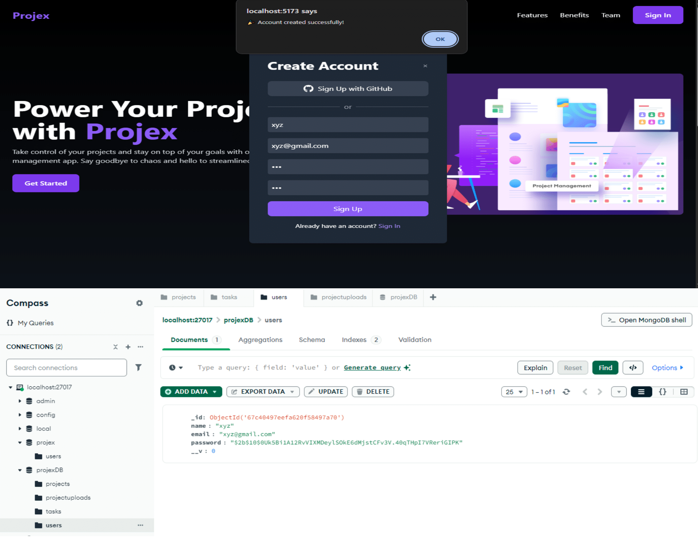
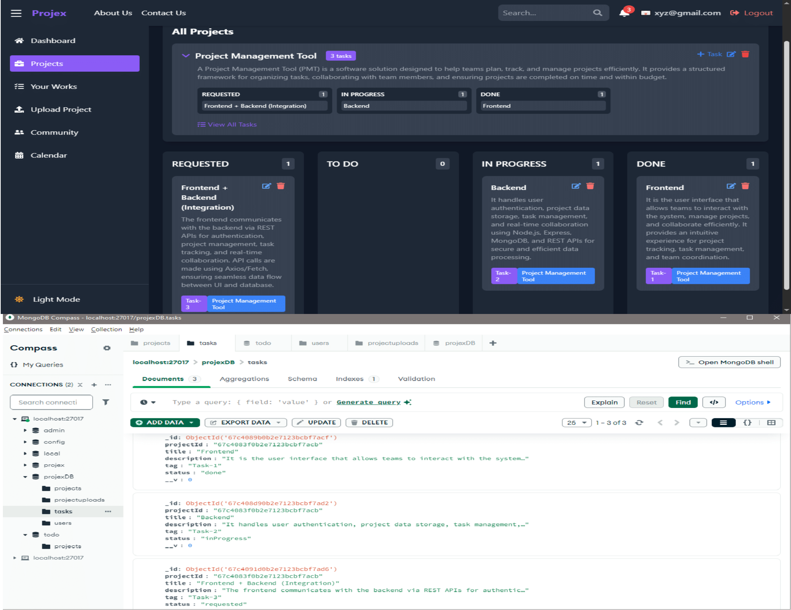
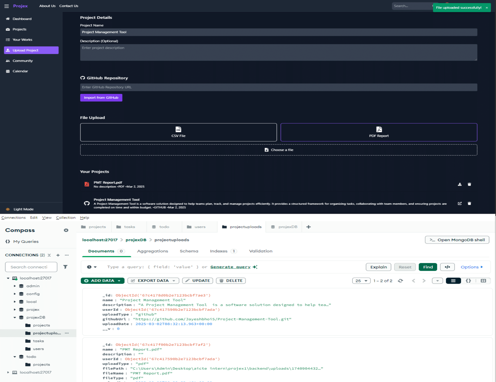

# 🔐 Projex - Project Management Tool

Projex is an **advanced project management platform** designed to help teams **collaborate, track progress, and manage projects efficiently**. With a seamless **OAuth-based authentication**, interactive **project board**, and a robust **upload system**, Projex enhances workflow productivity. 🚀

---

## 📸 Project Overview

### 🔐 OAuth Authentication  
Projex uses **OAuth-based authentication** for **secure and hassle-free login**. Users can sign in using third-party providers, ensuring **fast access and data security**.  


### 🖼 Project Board  
The **Project Board** provides an **intuitive UI to manage tasks**. Users can **track, update, and organize** project milestones with ease.  


### 📤 Upload Projects  
With the **Upload Projects** feature, users can **add, manage, and share** project files effortlessly. It ensures **seamless file handling** within the workspace.  


---

## 🚀 Features

- 🔒 **OAuth Authentication** - Secure login with third-party providers.
- 📁 **Project Board** - Plan, assign, and track tasks efficiently.
- 📤 **Upload Projects** - Manage and store project files with ease.
- 🏗 **Full-Stack Implementation** - A powerful frontend-backend integration.

---

## 🛠 Tech Stack

- **Frontend:** React, Tailwind CSS
- **Backend:** Node.js, Express.js
- **Database:** MongoDB
- **Authentication:** OAuth 2.0

---

## 📦 Installation

```bash
# Clone the repository
git clone https://github.com/yourusername/projex.git

# Navigate to the project directory
cd projex

# Install dependencies
npm install

# Start the backend server
npm run server

# Start the frontend
npm run client
